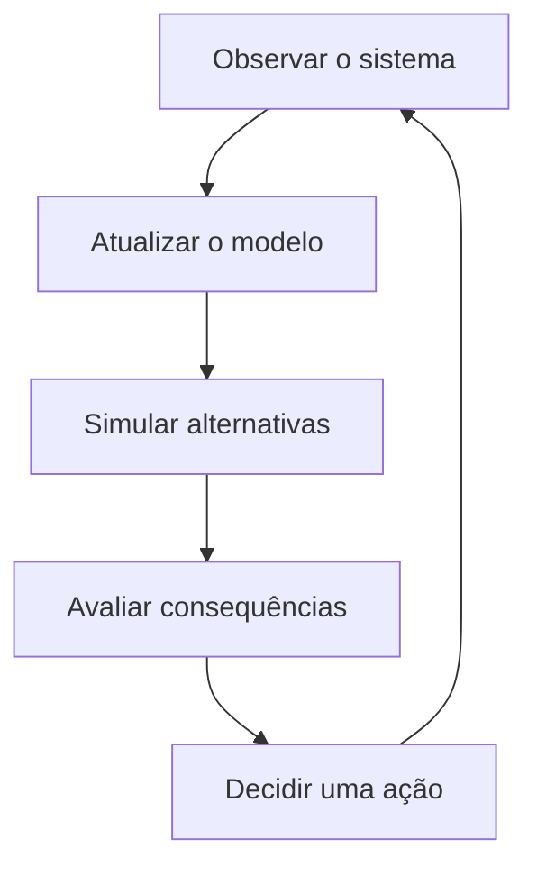

# Plano principal do experimento — Partial Digital Twin

> **Status:** referência principal do experimento.
>
> Decisões de arquitetura, implementação, instrumentação e avaliação deste fork
> devem ser justificadas em relação a este documento. Em caso de conflito com
> ideias exploratórias posteriores, este plano permanece autoritativo até ser
> explicitamente revisado.

O progresso de implementação, os critérios de saída e as pendências são
mantidos no [`tcc-experiment-roadmap.md`](./tcc-experiment-roadmap.md).

## Direção do trabalho

O principal ganho potencial do Partial Digital Twin (PDT) não é necessariamente
produzir uma latência menor ou executar testes mais rapidamente. Essas são
métricas de custo e desempenho do mecanismo. O ganho distintivo está em
transformar a validação de uma execução passiva em um sistema capaz de:

- representar o estado relevante do sistema operacional;
- experimentar mudanças sem afetá-lo;
- prever consequências;
- comparar alternativas contrafactuais;
- recomendar ou executar uma decisão pré-deployment.

Em outras palavras:

> O staging responde: “esta versão passou neste ambiente?”

> O PDT pretende responder: “considerando o estado atual do sistema, o que
> provavelmente acontecerá se esta versão for implantada — e qual ação devemos
> tomar?”

## Onde está a agência

A agência pode ser entendida como a capacidade de fechar um ciclo:

No experimento, a ação não precisa ser aplicada diretamente em produção. Ela
pode ocorrer no pipeline:

- aprovar o deployment;
- bloqueá-lo;
- recomendar rollback;
- ajustar parâmetros;
- escolher uma configuração;
- solicitar revisão humana;
- selecionar testes adicionais;
- testar automaticamente outra alternativa.

Existem níveis diferentes de agência:

| Nível | Capacidade |
| --- | --- |
| Descritivo | Representa o estado atual |
| Preditivo | Estima o resultado de uma implantação |
| Prescritivo | Recomenda uma decisão |
| Semiautônomo | Executa uma ação no pipeline com supervisão |
| Autônomo | Atua no sistema operacional sem intervenção |

Para manter o TCC viável, o nível escolhido é o **semiautônomo no pipeline**, e
não a atuação automática em produção.

## Distinção em relação ao staging

O simples fato de ser parcial, automatizado ou baseado em Kubernetes não
transforma o ambiente em um PDT. Um staging também pode executar testes
automaticamente.

| Staging tradicional | Partial Digital Twin |
| --- | --- |
| Executa uma candidata em cenário predefinido | Simula candidatas considerando o estado operacional observado |
| Produz resultado de teste | Produz previsão sobre o comportamento operacional |
| Normalmente avalia uma configuração | Pode comparar múltiplas ações possíveis |
| Usa critérios fixos de aprovação | Pode selecionar uma ação com base no modelo |
| Não exige calibração contra produção | Sua fidelidade é verificada e recalibrada |
| Responde “passou ou falhou?” | Responde “o que acontecerá e o que devemos fazer?” |

Previsibilidade e agência não são exclusivas de Digital Twins. Um staging
sofisticado também pode executar testes, comparar configurações e bloquear
deployments. Para sustentar o conceito de PDT, o protótipo deve combinar a
agência com:

1. vínculo explícito com uma instância operacional;
2. sincronização de estado relevante;
3. modelo executável ou simulável;
4. avaliação contínua da fidelidade da previsão;
5. uso da previsão para orientar uma decisão.

Sem esses elementos, o protótipo corre o risco de ser caracterizado apenas como
um staging adaptativo.

## Questão de pesquisa

Questão principal:

> Em que medida um Partial Digital Twin, sincronizado com o estado operacional,
> acrescenta capacidade de impedir decisões pré-deployment inseguras quando
> incorporado a uma esteira convencional completa de CI/CD com staging?

Formulação operacional e mensurável:

> Entre as candidatas aprovadas por CI/CD e staging, qual proporção de mudanças
> prejudiciais é adicionalmente detectada por um gate PDT, quantas mudanças
> seguras ele bloqueia e qual é seu custo incremental?

O objeto de comparação não é somente a execução dos testes, mas a **qualidade
da decisão produzida**.

## Desenho experimental revisado para reduzir viés

O experimento não será desenhado a partir de falhas escolhidas depois de
conhecer o comportamento do PDT. Isso favoreceria o mecanismo que se pretende
avaliar. A unidade experimental será uma **versão candidata opaca** que possa
afetar o caminho de checkout. Ela pode alterar o `checkoutservice`, uma de suas
dependências ou a infraestrutura que condiciona seu comportamento. O objeto
representado pelo twin continua sendo o `checkoutservice`; as repetições de
carga são medições da mesma unidade e não novas amostras independentes.

### Hipótese e estimandos

A hipótese principal é que, para o mesmo conjunto ainda não observado de
candidatas, adicionar o PDT a uma esteira completa reduz a proporção de
**aprovações inseguras** em relação à esteira convencional com staging, sem
aumentar de forma inaceitável os **bloqueios desnecessários**.

Dois resultados devem permanecer separados:

1. **classificação comparável:** cada mecanismo deve dizer se a candidata
   `deploy-as-is` é segura ou insegura;
2. **utilidade prescritiva adicional:** o PDT pode recomendar uma configuração
   alternativa e será avaliado pela segurança e pelo custo dessa ação.

Essa separação evita creditar ao PDT uma vantagem meramente causada por ele ter
mais opções de saída do que o staging.

### Corpus de candidatas

O corpus de avaliação deve conter, em proporção definida antes da coleta:

- controles seguros, como refatorações ou alterações observacionalmente
  equivalentes;
- mutações funcionais controladas no fluxo de checkout e pagamento;
- mutações não funcionais controladas de latência, disponibilidade, CPU ou
  memória;
- alterações de dependências ou infraestrutura cujo efeito seja observável no
  `checkoutservice`;
- casos independentes do contexto e casos cujo efeito dependa de carga,
  configuração ou estado de dependências.

As mutações serão geradas a partir de operadores, faixas e sementes congelados
antes da avaliação. Exemplos admissíveis incluem cobrança ausente ou com valor
incorreto, propagação incorreta de falha, atraso condicionado por entrada, uso
adicional limitado de CPU e falha intermitente. O corpus também precisa conter
candidatas seguras; sem elas não é possível medir falsos positivos.

Os mecanismos recebem apenas um identificador opaco, a imagem e os metadados
necessários ao deployment. O tipo de mutação e o resultado esperado ficam em
um manifesto reservado ao oráculo e não podem ser lidos pelo staging, pelo
`checkout-pdt-controller` nem pelos scripts que calculam suas decisões.

O catálogo inicial de operadores e seus controles está em
[`tcc-candidate-scenarios.md`](./tcc-candidate-scenarios.md).

### Comparador: uma esteira convencional completa

O controle experimental não é apenas um namespace de staging. Toda candidata
deve atravessar uma esteira convencional defensável, com pelo menos:

1. identificação imutável do commit e da candidata;
2. formatação, lint, compilação e testes unitários dos componentes alterados;
3. análise de segredos, SAST e dependências;
4. build da imagem, inventário de componentes e análise de vulnerabilidades;
5. renderização e validação de manifests, IaC e políticas de segurança;
6. testes de integração e contrato do caminho de checkout;
7. implantação efêmera em staging, readiness e smoke tests;
8. testes E2E funcionais, caminhos negativos e carga não funcional fixa;
9. decisão auditável de release e gate humano.

A profundidade exata dessas etapas será congelada antes da coleta. O objetivo
não é construir uma esteira deliberadamente fraca, e sim medir se o PDT oferece
valor incremental mesmo após práticas convencionais razoáveis.

### Comparação pareada e justa

Cada candidata será avaliada pelos dois mecanismos:

| Condição | Evidência e decisão |
| --- | --- |
| Controle | CI/CD convencional completo, incluindo staging forte, invariantes e SLOs congelados, contexto fixo e decisão `approve` ou `block` |
| Tratamento | a mesma CI/CD e o mesmo staging, acrescidos do snapshot operacional permitido, modelo PDT, alternativas contrafactuais, previsão e ação `approve`, `block` ou `reconfigure` |

Não haverá uma asserção funcional conhecida somente pelo PDT. Regras como “um
checkout bem-sucedido deve produzir uma cobrança válida” pertencem ao contrato
do sistema e devem ser verificáveis nos dois mecanismos. O tratamento cuja
utilidade se quer medir é o ciclo adicional do twin: sincronizar o estado,
materializar contexto relevante, explorar consequências e selecionar uma
ação.

A decisão da esteira convencional será selada antes da consulta à decisão do
PDT. Na execução operacional do pipeline, somente candidatas aprovadas pelo
controle precisam alcançar o gate PDT. A análise principal mede, nesse
subconjunto, a **detecção incremental** de candidatas prejudiciais e o
**bloqueio incremental** de candidatas seguras. As candidatas rejeitadas antes
continuam registradas para demonstrar a cobertura da esteira convencional.

O limite máximo de duração e capacidade-tempo por decisão será definido antes
da execução. Caso o PDT consuma mais recursos para explorar alternativas, esse
custo será medido e apresentado junto ao ganho de detecção, e não ocultado. A
ordem das candidatas será randomizada, os ambientes serão limpos entre
execuções e não haverá execução concorrente entre staging, PDT e oráculo.

### Oráculo independente e vedação dos resultados

As decisões dos dois mecanismos serão persistidas e tornadas imutáveis antes
de revelar o rótulo da candidata. Depois disso, um terceiro fluxo executará uma
matriz mais ampla de testes e carga em ambiente efêmero, isolado e sem exposição
pública. Esse **oráculo de validação** determinará, segundo o contrato congelado:

- se `deploy-as-is` é segura;
- quais requisitos funcionais ou não funcionais foram violados;
- se alguma alternativa permitida torna a candidata segura;
- qual ação válida tem o menor custo predefinido.

O oráculo não será tratado como infalível: seu resultado deve combinar o
manifesto da mutação, as asserções determinísticas e a evidência de execução.
Se houver discordância, a candidata será classificada pela regra de adjudicação
definida previamente, sem alterar retrospectivamente os mecanismos avaliados.

Nenhuma candidata adversarial será implantada na instância operacional pública.
O ambiente `operational` fornece o estado de origem; a confirmação do efeito da
candidata ocorre no ambiente isolado do oráculo. A fidelidade do PDT será
calculada comparando sua previsão com essa observação controlada sob o mesmo
perfil de estado.

### Controles contra viés e vazamento

Antes da primeira execução válida devem ser congelados e versionados:

- requisitos, invariantes, SLOs e pesos de decisão;
- operadores de mutação, proporções por classe e sementes;
- tamanho do corpus, repetições e regra de parada;
- suítes do staging, do PDT e do oráculo;
- orçamento de tempo e recursos por decisão;
- randomização da ordem, exclusões e tratamento de dados ausentes;
- modelo, parâmetros e dados usados para calibrar o PDT;
- plano estatístico e métricas primárias/secundárias.

O corpus de avaliação não pode ser usado para ajustar limiares ou o modelo.
Qualquer ajuste posterior cria uma nova versão do protocolo e exige um novo
conjunto de candidatas. As execuções já realizadas com `current` e
`checkout-cpu-restriction-v1` são **pilotos de engenharia/calibração** e não
integram a comparação confirmatória principal.

## Métricas centrais

As métricas de latência e recursos continuam necessárias, mas são evidências
usadas pelo sistema, e não o principal resultado.

- **Taxa de aprovação insegura:** candidatas prejudiciais aprovadas; é o
  desfecho primário de segurança.
- **Sensibilidade:** proporção de candidatas prejudiciais corretamente
  identificadas.
- **Especificidade:** proporção de candidatas seguras corretamente preservadas.
- **Taxa de bloqueio desnecessário:** candidatas seguras rejeitadas.
- **Acurácia balanceada:** média entre sensibilidade e especificidade, evitando
  que o balanço artificial das classes domine a conclusão.
- **Qualidade da ação:** arrependimento ou distância entre a ação escolhida e a
  melhor ação conhecida pelo oráculo.
- **Erro de previsão:** diferença entre resultado simulado e operacional.
- **Cobertura contrafactual:** quantidade de alternativas avaliadas antes da decisão.
- **Tempo até a decisão:** custo para observar, simular e decidir.
- **Custo computacional por decisão e por regressão evitada.**
- **Grau de autonomia:** quais etapas não exigiram intervenção humana.

Matriz básica de classificação:

| Decisão do ambiente | Resultado operacional | Classificação |
| --- | --- | --- |
| Aprovar | Implantação segura | Decisão correta |
| Aprovar | Ocorre regressão | Decisão insegura |
| Bloquear | Ocorreria regressão | Regressão evitada |
| Bloquear | Implantação seria segura | Bloqueio desnecessário |

Como as mesmas candidatas aprovadas pelo controle recebem também uma decisão
PDT, a análise incremental é pareada nesse subconjunto. As diferenças de
aprovação segura serão analisadas no nível da candidata, com intervalos de
confiança e teste pareado apropriado para resultados binários.
Repetições de uma candidata serão agregadas antes dessa análise para evitar
pseudorreplicação.

## Recorte do protótipo

O protótipo será posicionado como um:

> **Partial Digital Twin preditivo e prescritivo para suporte semiautônomo à
> decisão pré-deployment.**

### Fronteira explícita do gêmeo parcial

O objeto geminado **não é toda a Online Boutique**. O ativo lógico representado
pelo PDT é o **`checkoutservice`**, responsável por orquestrar a transação de
compra. O estado, o modelo, as previsões e as ações prescritivas do twin são
delimitados a esse serviço.

A interação `checkoutservice → paymentservice` é observada porque afeta o
comportamento do objeto geminado, mas o `paymentservice` é uma dependência do
ambiente e não um segundo objeto geminado.

O `frontend` fornece a carga de entrada e o endpoint observável de checkout.
`cartservice`, `currencyservice`, `paymentservice`, `shippingservice` e
`emailservice` formam o contexto de dependências necessário para executar a
transação ponta a ponta, mas não são objetos de otimização do twin. `productcatalogservice`,
`recommendationservice`, `adservice` e a navegação de catálogo permanecem no
ambiente para preservar realismo de carga, porém estão fora da fronteira
decisória do PDT.

| Dentro da fronteira do PDT | Contexto observado | Fora do modelo decisório |
| --- | --- | --- |
| checkoutservice | frontend, cart, currency, payment, shipping e email | catálogo, recomendação, anúncios e apresentação visual |
| versão, configuração, réplicas e recursos do checkoutservice | carga de checkout, contratos e saúde das dependências | versões e otimização das dependências |
| estado, erros e latência atribuíveis ao checkoutservice | recursos do cluster que afetam a execução | otimização global de todos os microserviços |

As demais aplicações podem ser implantadas durante a simulação para fornecer
um ambiente executável, mas isso não significa que todas sejam geminadas. A
parcialidade decorre da seleção explícita de estado, relações, previsões e ações
do caminho de checkout.

As saídas primárias do modelo são: sucesso funcional do checkout, erros
propagados pelas dependências, latência p95/p99 do fluxo, reinícios e saturação
de CPU/memória do `checkoutservice`. As ações permitidas são aprovar ou bloquear
uma candidata do `checkoutservice` e recomendar réplicas, recursos ou parâmetros
de timeout desse serviço.

O sistema deve:

1. sincronizar carga, configuração e limites de recursos;
2. receber uma versão candidata;
3. simular duas ou três ações possíveis;
4. prever latência, erros e correção funcional;
5. selecionar a ação que satisfaz as restrições;
6. aprovar, bloquear ou recomendar uma configuração;
7. comparar a previsão com o resultado operacional;
8. registrar o erro para futura recalibração.

### Separação entre observabilidade e o controlador PDT

O protótipo terá um componente identificado como **`checkout-pdt-controller`**
no namespace **`pdt-system`**. O namespace `observability` não hospeda o twin:
ele fornece telemetria e evidência. O namespace `pdt` é o plano de execução das
simulações contrafactuais. O `checkout-pdt-controller` forma o plano de controle
que transforma observações em estado, previsão e decisão prescritiva.

Essa separação impede que uma pilha tradicional de métricas ou um gate de CI/CD
seja apresentado como se fosse o próprio PDT.

O namespace `pdt-system` foi criado no cluster com quota própria e sem workloads
permanentes. A implementação atual do comportamento do PDT ainda é executada
pelos scripts do experimento; o próximo incremento é empacotar essa lógica como
o runtime identificável `checkout-pdt-controller`. Portanto, a existência do
namespace não deve ser descrita como se o controlador já estivesse implantado.

Isso captura o poder de agência sem exigir um sistema autônomo complexo ou
permitir que o protótipo altere uma produção real.

## Princípio metodológico

**Não comparar apenas dois ambientes; comparar duas políticas completas de
decisão.**

A condição de controle é uma CI/CD convencional completa, incluindo staging.
A condição de tratamento preserva todos esses gates e acrescenta um mecanismo
sincronizado de previsão, simulação contrafactual e escolha de ação. Essa é a
contribuição central que deve orientar o desenvolvimento e a avaliação do
experimento.
